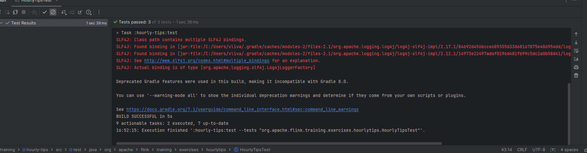
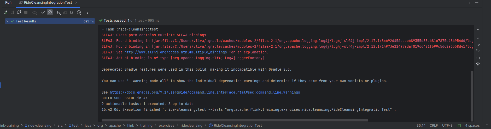
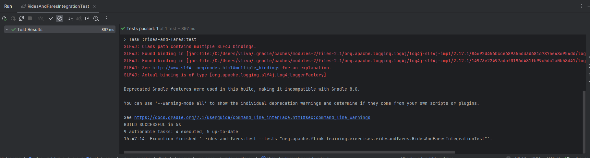
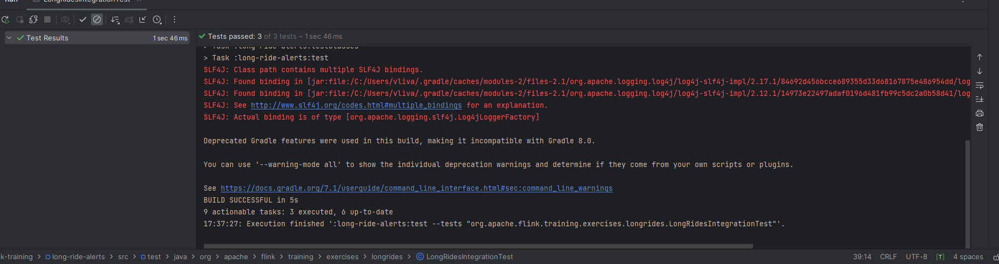

HourlyTipsExercise

fares.keyBy((TaxiFare fare) -> fare.driverId): Сначала данные (в данном случае, объекты TaxiFare) группируются по полю driverId. Таким образом, все данные с одним и тем же driverId попадают в одну группу.

.window(TumblingEventTimeWindows.of(Time.hours(1))): Затем для каждой группы данных определяется окно времени. В данном случае, используется окно времени событий (EventTime) длительностью 1 час. Это означает, что данные для каждого driverId будут группироваться в окна по 1 часу.

.process(new HourlyTipsSolution.AddTips()): Для каждого окна данных вызывается пользовательская функция AddTips, которая, вероятно, вычисляет сумму чаевых (tips) за каждый час для каждого водителя. В результате этого шага, у появляется DataStream с информацией о часовых чаевых для каждого водителя.

hourlyTips.windowAll(TumblingEventTimeWindows.of(Time.hours(1))).maxBy(2): Здесь происходит глобальное окончательное окно (windowAll), где данные со всех водителей группируются в еще одно окно времени, и для каждого часа выбирается максимальное значение суммы чаевых (maxBy(2)), где 2 - это индекс столбца с суммой чаевых в Tuple3.

hourlyMax.addSink(sink): Наконец, результаты передаются в sink.

RideCleansingExercise

filter, который принимает объект TaxiRide и возвращает true, если начальные и конечные координаты маршрута (широта и долгота) находятся в пределах Нью-Йорка.

RidesAndFaresExercise

Реализованы два метода для объединения объектов TaxiRide и TaxiFare.

flatMap1 обрабатывает объект TaxiRide. Если уже существует соответствующий TaxiFare, то они объединяются в объект RideAndFare и отправляются в выходной поток. В противном случае, TaxiRide сохраняется в состоянии rideState.

flatMap2 обрабатывает объект TaxiFare. Если уже существует соответствующий TaxiRide, то они объединяются в объект RideAndFare и отправляются в выходной поток. В противном случае, TaxiFare сохраняется в состоянии fareState.

LongRidesExercise
Код начинается с присвоения значения переменной «rideState» новой переменной с именем «firstRideEvent». Если «firstRideEvent» имеет значение null, это означает, что в переменной «rideState» не хранится предыдущее событие поездки.

Если «firstRideEvent» имеет значение null, код обновляет переменную «rideState» текущим значением «ride». Если текущая поездка является стартовым событием (указанным свойством «isStart»), код регистрирует таймер времени события, используя «timerService», предоставляемый объектом «ext». Таймер устанавливается на основе метода getTimerTime, который принимает в качестве параметра текущую «поездку».

Если значение «firstRideEvent» не равно нулю, это означает, что в переменной «rideState» хранится предыдущее событие поездки. В этом случае код проверяет, является ли текущая поездка стартовым событием. Если да, код проверяет, не превысили ли текущая поездка и первое событие определенной продолжительности (определяемой методом rideTooLong). Если да, код собирает «rideId» текущей поездки с помощью сборщика «out».

Если текущая поездка не является стартовым событием, код удаляет таймер времени события, связанный с первым событием поездки, используя «timerService», предоставленный объектом «context». Затем он проверяет, превысили ли первая и текущая поездки определенную продолжительность. Если да, код собирает «rideId» текущей поездки с помощью сборщика «out».

